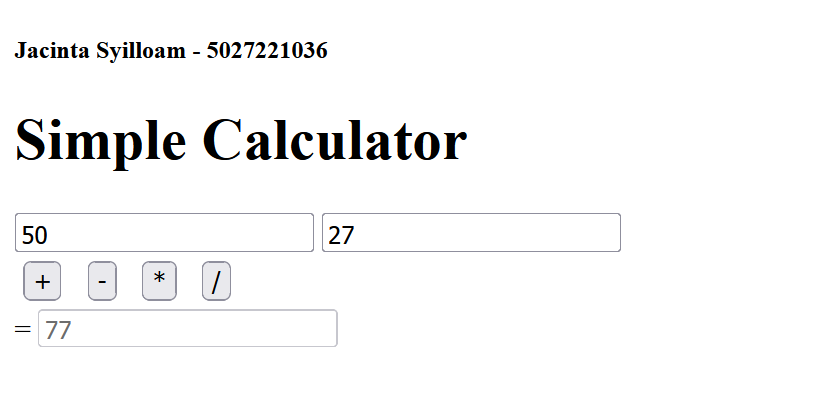
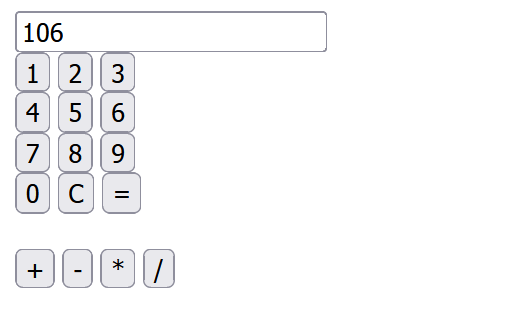

# Intro to JavaScript
Assignment instruction was to create a simple calculator that implements js, no styling is ok.

## Contents
1. **Calculator 1:** Performs basic math operation of 2 values, no number or operand buttons to click on
2. **Calculator 2:** Performs basic math operation of multiple values, has number and operand buttons to click on

## Preview of Simple Calculator 1

## Preview of Simple Calculator 2
