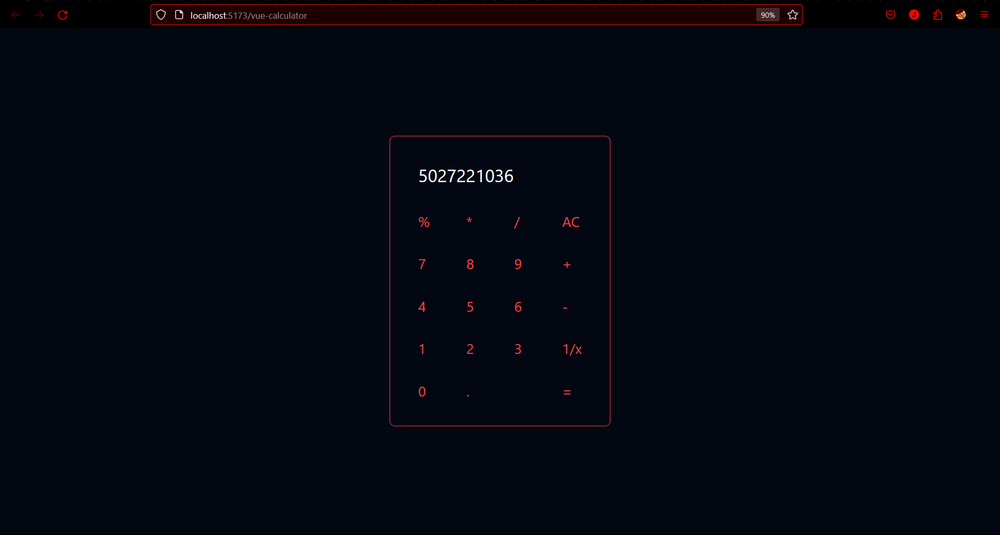

# vue-calculator
This is a simple calculator made using Vue and tailwind.

## Preview


## Deployments
This page has been deployed on these platforms:
1. Netlify: https://main--capable-starship-7bea83.netlify.app/
2. Github.io: https://jacintasyilloam.github.io/vue-calculator/
3. Vercel: https://vue-calculator-jk0nv0h5a-jacintasyilloam-gmailcom.vercel.app/

## Project Setup

```sh
npm install
```

### Compile and Hot-Reload for Development

```sh
npm run dev
```

